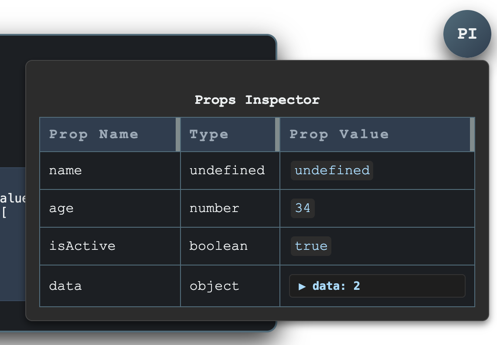

# PropsTableWrapper - React Prop Inspector

[](https://badge.fury.io/js/your-package-name)
[](https://opensource.org/licenses/MIT)

A React component that wraps your components to provide an on-page, toggleable props inspector table. Useful for debugging and understanding the props being passed to a component in real-time.

<!--  -->


## Features

* **Easy Integration**: Simply wrap the component you want to inspect.
* **Props Display**: Shows prop names, their JavaScript types, and their values.
* **Nested Data**: Handles and displays nested objects and arrays with collapsible sections.
* **Resizable Columns**: Adjust column widths in the props table for better readability.
* **Toggleable Inspector**: A "PI" (Props Inspector) button to show/hide the props table.
* **Potential Props Hinting**: Attempts to list potential props by parsing the child component's function signature (for functional components).
* **Minimal Styling**: Comes with basic CSS that can be easily overridden.

## Installation

Using npm:
```bash
npm install react-prop-inspector
```

## Usage

```jsx
import React from 'react';
import PropsTableWrapper from 'react-prop-inspector';

const Component = () => {
  return (
    <div>
      <h1>Hello, World!</h1>
      <PropsTableWrapper>
        <YourComponent />
      </PropsTableWrapper>
    </div>
  );
};